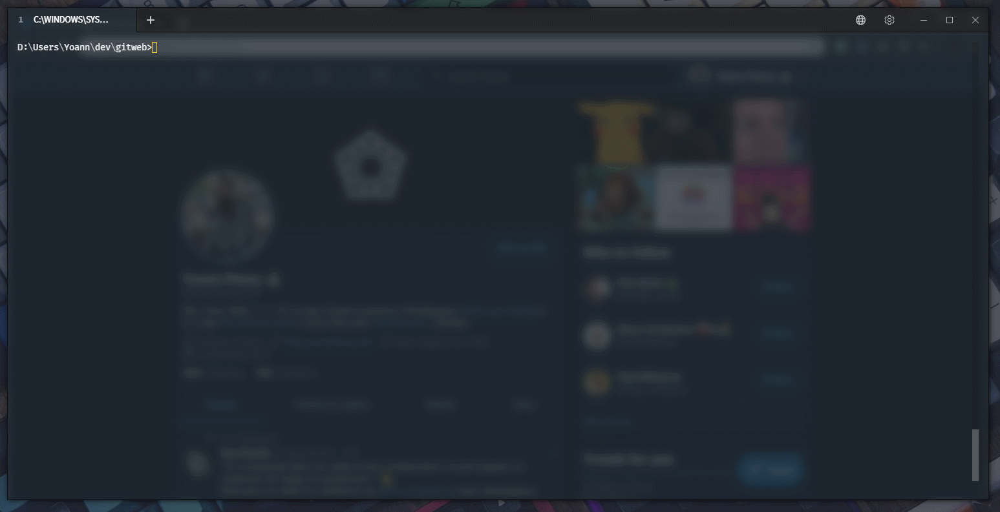

# gitweb

[](https://travis-ci.com/yoannfleurydev/gitweb#)

> 💡 This README is in a 🚧 WIP 🚧 status like all the code in this repository.
> Some of the flags and options are subject to change in the future.
> Ideas are welcome. Ideas are bulletproof (V).

`gitweb` is a command line interface I created mainly to learn Rust.



## Usage

`gitweb` will by default open the remote in the browser of the current
repository.

```
gitweb 0.1.4
Yoann Fleury <yoann.fleury@yahoo.com>
Open the current remote repository in your browser

USAGE:
    gitweb [FLAGS] [OPTIONS]

FLAGS:
    -h, --help       Prints help information
    -V, --version    Prints version information
    -v, --verbose    Set the verbosity of the command

OPTIONS:
    -b, --branch <branch>      Set the branch
    -B, --browser <browser>    Set the browser
    -r, --remote <remote>      Set the remote
```

## --branch

`gitweb` will open the current branch on the remote repository. You can override
the behavior by giving the `--branch` flag with the custom branch you want to
open in the browser.

## --browser

`gitweb` tries to start one of the following browser (in that order of priority):

- `$BROWSER` on Linux 🐧 or `%BROWSER%` on Windows 🏁 (this is a non standard variable)
- `--browser` option given in the command line
- the default web browser on the system

## --remote

`gitweb` will open the origin remote if it exists. You can override the behavior
by giving the `--remote` flag with the custom remote you want to open.
